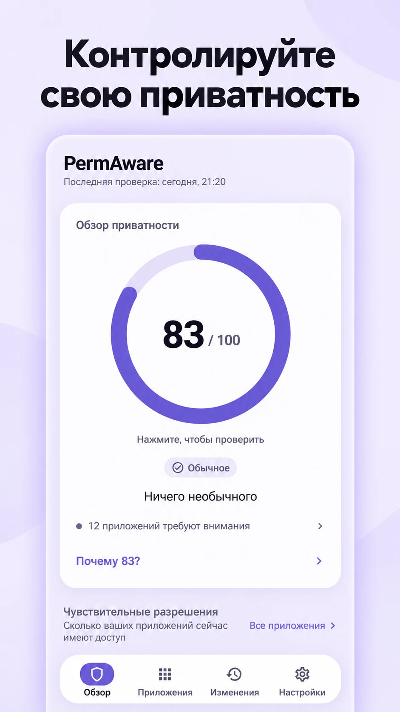
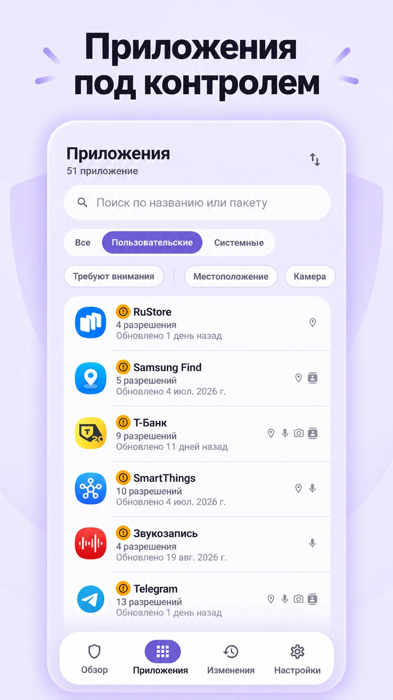
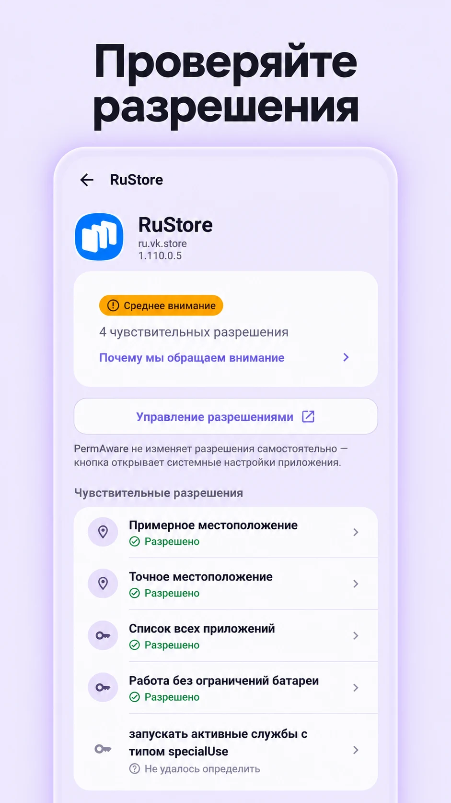
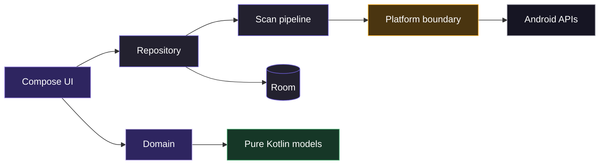

<div align="center">



<br>

**Локальный аудит разрешений Android — без аккаунта, сервера и доступа в интернет.**

<br>

<a href="https://github.com/vazovsky17/PermAware/actions/workflows/ci.yml"></a>
<a href="https://github.com/vazovsky17/PermAware/releases/latest"></a>


<br><br>

<a href="https://github.com/vazovsky17/PermAware/releases/latest/download/app-release.apk"></a>
<a href="https://github.com/vazovsky17/PermAware/releases/latest"></a>

<br><br>

[Возможности](#01--доступ-становится-видимым) · [Интерфейс](#02--интерфейс) · [Приватность](#03--приватность-по-архитектуре) · [Архитектура](#04--как-это-устроено) · [Сборка](#05--сборка-и-проверки)

</div>

<br>

## `01` · Доступ становится видимым

У приложений на телефоне десятки разрешений и особых доступов. Android прячет их по разным экранам,
показывает системными терминами и почти не помогает заметить изменения. **PermAware собирает всё в
одну понятную картину.**

<table>
<tr>
<td width="50%" valign="top">

### ◇ Обзор устройства

Объяснимый балл приватности, чувствительные категории и приложения, которым стоит уделить внимание.
Каждую цифру можно раскрыть и проверить.

</td>
<td width="50%" valign="top">

### ◇ Карточка приложения

Выданные разрешения, особые доступы и человеческое описание каждого пункта — без необходимости
расшифровывать Android-константы.

</td>
</tr>
<tr>
<td width="50%" valign="top">

### ◇ История изменений

PermAware замечает установку, обновление, выдачу и отзыв разрешений. Новый снимок сравнивается с
предыдущим, а не просто заменяет его.

</td>
<td width="50%" valign="top">

### ◇ Честная неопределённость

Если Android не позволяет узнать состояние доступа, приложение пишет «Не удалось определить» и
объясняет почему. Оно не дорисовывает удобный ответ.

</td>
</tr>
</table>

> [!IMPORTANT]
> PermAware — инспектор, а не антивирус. Разрешение показывает возможность приложения, но само по
> себе не делает его вредоносным. Контекст важнее тревожной иконки.

| Сигнал | Результат |
| :-- | :-- |
| Проверенный набор | **473 пакета** на Samsung Galaxy A17 с Android 16 |
| Полная проверка | **≈ 1,5 секунды**, вне главного потока |
| Тестовая матрица | **81 JVM + 113 device tests** |
| Релиз | **4,2 МБ APK · 5,1 МБ AAB** |
| Платформа | **minSdk 28 · targetSdk 36 · RU / EN** |

<br>

## `02` · Интерфейс

<table>
<tr>
<td width="33.33%" align="center" valign="top">

<br><sub><b>ОБЗОР</b><br>Общее состояние устройства и объяснимый балл</sub>
</td>
<td width="33.33%" align="center" valign="top">

<br><sub><b>ПРИЛОЖЕНИЯ</b><br>Поиск, фильтры и чувствительные категории</sub>
</td>
<td width="33.33%" align="center" valign="top">

<br><sub><b>ДЕТАЛИ</b><br>Разрешения и особые доступы без догадок</sub>
</td>
</tr>
</table>

<br>

## `03` · Приватность по архитектуре

Здесь приватность держится не на обещании в политике, а на том, **чего приложение технически не
умеет делать**.

```text
account              none
backend              none
analytics            none
advertising SDK      none
INTERNET permission  not declared
cloud backup         disabled
device transfer      disabled
```

- Результаты проверок остаются в приватной базе Room.
- Список установленных приложений некуда загрузить: сетевого разрешения нет в релизном манифесте.
- После удаления приложения история хранит только уже записанные название, пакет и версию — и
  удаляет их после окончания срока хранения.
- Переход наружу выполняется только по действию пользователя через `ACTION_VIEW`; данные к нему не
  прикладываются.
- Экспорт отчёта запускается вручную через системный лист «Поделиться».

### Зачем нужен `QUERY_ALL_PACKAGES`

Это разрешение позволяет увидеть приложения, которые установил пользователь. Без него Android
возвращает почти пустой набор — что делает аудит бессмысленным. Разница измерена одним и тем же
инструментальным зондом:

| Конфигурация | Видно пользовательских приложений |
| :-- | --: |
| С `QUERY_ALL_PACKAGES` | **53** |
| Без него | **2** — PermAware и тестовый APK |

До первой проверки приложение показывает заметное объяснение. Элемент `<queries>` не подходит:
он не умеет выразить «все приложения, установленные пользователем».

<details>
<summary><b>Что Android позволяет определить, а что скрывает</b></summary>

<br>

| Возможность | Что видит PermAware |
| :-- | :-- |
| Запрошенные разрешения и состояние выдачи | Полностью |
| Уровень защиты разрешения | Полностью |
| Спецвозможности, слушатель уведомлений, администратор устройства, белый список батареи | Состояние читается через документированные API |
| Поверх других окон, установка неизвестных приложений, доступ к статистике, ко всем файлам, запись настроек | AppOps: читается на части устройств; в остальных случаях состояние отмечается как неизвестное |
| Активна ли VPN прямо сейчас | Недоступно; видно только объявление в манифесте |
| Изменения в реальном времени | Потребовали бы постоянную foreground-службу, которую PermAware принципиально не использует |

</details>

<br>

## `04` · Как это устроено

Один Android-модуль, строгие границы между слоями и чистый Kotlin там, где платформе делать нечего.



`PackageInfo`, `ApplicationInfo` и `PermissionInfo` останавливаются в `data/platform`. Выше живут
только собственные модели, поэтому движок внимания, сравнение снимков и генератор отчёта быстро
проверяются на JVM.

```text
packages → permissions → special access → attention
         → privacy overview → snapshot diff → transaction → retention
```

<details>
<summary><b>Структура исходников</b></summary>

```text
app/src/main/java/app/vazovsky/permaware/
├── core/               конфигурация, ссылки и подменяемые часы
├── domain/
│   ├── model/          чистые Kotlin-модели
│   ├── permission/     офлайновая база знаний
│   ├── attention/      внимание и обзор приватности
│   ├── diff/           движок изменений
│   └── export/         генератор отчёта
├── data/
│   ├── platform/       граница Android API
│   ├── db/             снимки и события в Room
│   ├── prefs/          DataStore
│   └── repository/     источник истины
├── scan/               конвейер и фоновые проверки
├── ui/                 Compose, навигация, компоненты и тема
└── di/                 модули Hilt
```

</details>

### Стек

<p>
  &nbsp;&nbsp;&nbsp;
  &nbsp;&nbsp;&nbsp;
  &nbsp;&nbsp;&nbsp;
  &nbsp;&nbsp;&nbsp;
  
</p>

`Kotlin` · `Coroutines` · `Flow` · `Jetpack Compose` · `Material 3` · `Room` · `DataStore` · `Hilt`

<br>

## `05` · Сборка и проверки

Нужны JDK 17 и Android SDK с API 36. Минимальная версия устройства — Android 9 / API 28.

```bash
git clone https://github.com/vazovsky17/PermAware.git
cd PermAware
./gradlew :app:assembleDebug
```

Готовый APK появится в `app/build/outputs/apk/debug/`.

### Проверки качества

```bash
./gradlew :app:ktlintCheck                # стиль
./gradlew :app:lintRelease                # Android lint
./gradlew :app:testDebugUnitTest          # 81 JVM-тест
./gradlew :app:connectedDebugAndroidTest  # 113 device-тестов
```

GitHub Actions запускает стиль, lint, JVM-тесты и релизную сборку для каждого push и pull request.
UI-тесты используют фиксированные платформенные данные, поэтому их результат не зависит от набора
приложений на телефоне.

<details>
<summary><b>Релизная сборка и подпись</b></summary>

```bash
./gradlew :app:assembleRelease
./gradlew :app:bundleRelease
```

Ключ хранится вне Git в `signKeystore/`. Рядом нужен файл `key.properties`:

```properties
RELEASE_STORE_FILE=permaware-upload.jks
RELEASE_STORE_PASS=…
RELEASE_ALIAS=permaware-upload
RELEASE_KEY_PASS=…
```

В CI используются `PERMAWARE_KEYSTORE_PATH`, `PERMAWARE_KEYSTORE_PASSWORD`,
`PERMAWARE_KEY_ALIAS` и `PERMAWARE_KEY_PASSWORD`. Источник принимается только целиком; окружение
имеет приоритет над файлом.

Без ключа Gradle собирает неподписанный релиз и сообщает об этом. Частичная конфигурация намеренно
останавливает `verifyReleaseSigning`.

```bash
apksigner verify --print-certs app/build/outputs/apk/release/app-release.apk
```

> Храните резервную копию ключа и пароля офлайн. Без неё обновить установленное приложение нельзя.

</details>

<details>
<summary><b>Зонды возможностей Android</b></summary>

Инструментальные зонды оставлены в проекте, чтобы выводы о платформе можно было повторить на новой
версии Android или другом устройстве.

```bash
./gradlew :app:connectedDebugAndroidTest \
  -Pandroid.testInstrumentationRunnerArguments.class=app.vazovsky.permaware.probe.CapabilityProbeTest
adb logcat -s PWProbe PWProbe2 PWVis PWScan
```

</details>

<details>
<summary><b>Локализация и конфигурация</b></summary>

Русские строки лежат в `res/values/`, английские — в `res/values-en/`. Названия доменных сущностей
превращаются в текст только в `ui/common/Labels.kt`; числа проходят через `plurals`.

Новый язык нужно одновременно добавить в:

- `res/values-xx/strings.xml` и `strings_permissions.xml`;
- `res/xml/locales_config.xml`;
- `androidResources.localeFilters`.

Внешние ссылки задаются свойствами `permaware.boostyUrl`, `permaware.githubUrl` и
`permaware.contactUrl` в `gradle.properties`. Если ссылка не задана, соответствующий элемент
интерфейса не показывается.

</details>

<br>

## Лицензия

Исходники открыты для чтения, изучения, аудита и оценки, но не для перевыпуска. Нельзя публиковать
собственные сборки или использовать название, иконки и графику PermAware. Полные условия — в
[LICENSE](LICENSE).

<br>

## Благодарности

В работе над документацией, тестами, текстом лицензии и формулировкой основных принципов продукта
участвовал [Claude Code](https://claude.com/claude-code).

<br>

---

<div align="center">

**PermAware показывает факты. Решение всегда остаётся за вами.**

<a href="https://github.com/vazovsky17/PermAware/releases/latest/download/app-release.apk"></a>
<a href="https://t.me/vazovsky17"></a>

<br><br>

<sub>Created by <b>Vazovsky Studio</b> · Kotlin + Compose · Privacy by architecture</sub>

</div>
